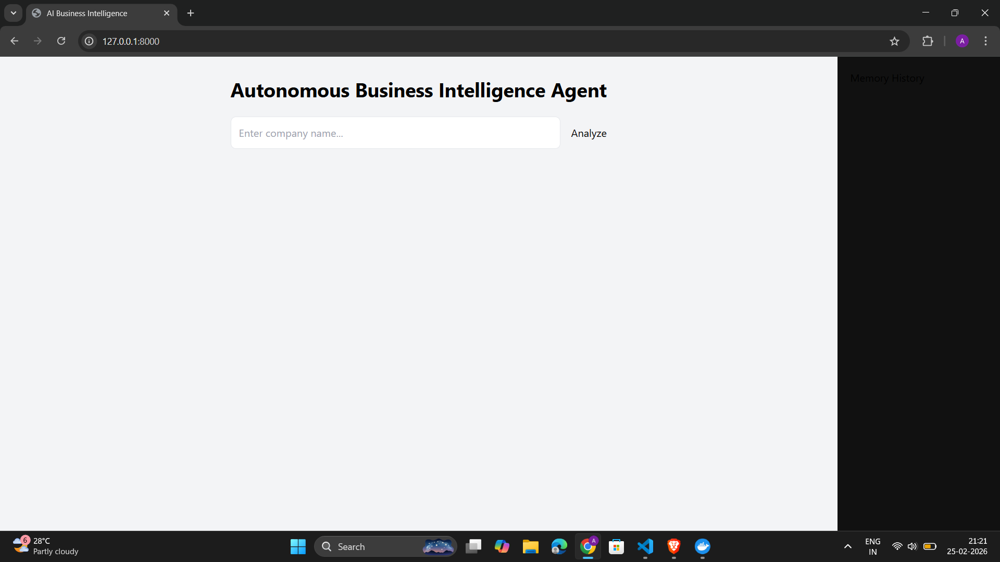
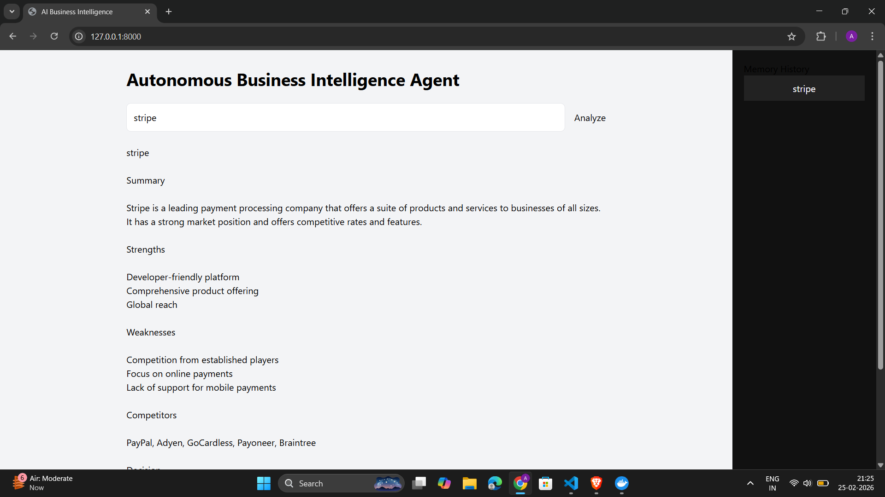
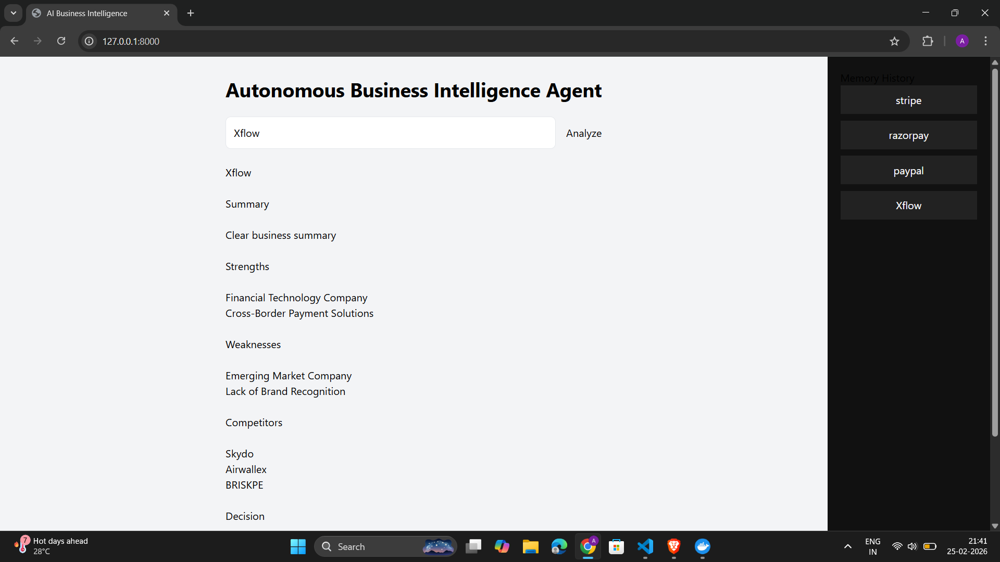
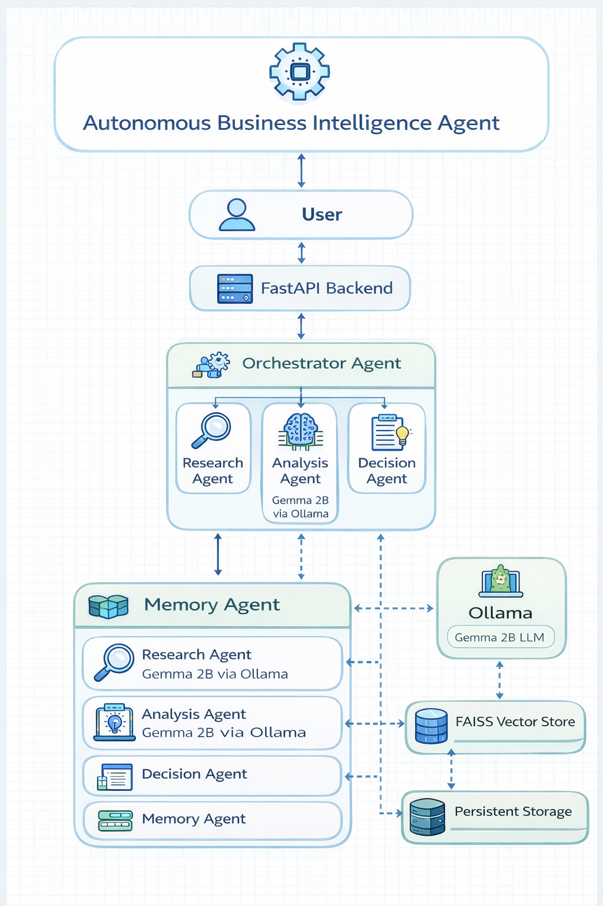

# Autonomous Business Intelligence Agent (Local LLM, Multi-Agent System)

A fully autonomous AI system that performs company intelligence analysis using a locally running LLM, structured multi-agent architecture, and persistent vector memory.

This project demonstrates production-grade AI system design without relying on paid APIs.

---

## Demo


---

## UI Preview

### Home Screen


### Analysis Result


### Memory Sidebar


---

## Features

- Multi-Agent Architecture
- Local LLM execution using Gemma 2B via Ollama
- Persistent vector memory using FAISS
- Autonomous company intelligence generation
- SWOT analysis
- Competitor identification
- Investment recommendation engine
- Decision-making agent
- FastAPI backend
- Interactive web UI
- Dockerized deployment

---

## Architecture



---

## Agents Overview

### Research Agent
Collects company information from available sources.

### Analysis Agent
Uses local LLM (Gemma 2B via Ollama) to generate structured business analysis.

### Decision Agent
Evaluates analysis and produces investment recommendation.

### Memory Agent
Stores analysis in FAISS vector database and retrieves previous results.

---

## Example Output

```
Company: Stripe

Summary:
Stripe is a global financial infrastructure platform providing payment processing APIs...

Strengths:
- Developer-friendly APIs
- Global payment support

Weaknesses:
- Highly competitive market

Competitors:
- PayPal
- Razorpay

Investment Recommendation:
Buy

Risk Level:
Medium

Market Position:
Leader
```

---

## Tech Stack

Backend:
- Python
- FastAPI

AI:
- Ollama
- Gemma 2B
- Sentence Transformers
- FAISS

Frontend:
- HTML
- TailwindCSS

Deployment:
- Docker

---

## How to Run Locally

### Step 1 — Install Ollama

https://ollama.com/download

Run:

```
ollama pull gemma:2b
ollama run gemma:2b
```

---

### Step 2 — Clone repo

```
git clone https://github.com/yourusername/business-agent.git

cd business-agent
```

---

### Step 3 — Install dependencies

```
pip install -r requirements.txt
```

---

### Step 4 — Run server

```
uvicorn main:app --reload
```

Open:

```
http://localhost:8000
```

---

## Docker Deployment

Build:

```
docker build -t business-agent .
```

Run:

```
docker run -p 8000:8000 business-agent
```

---

## Key Engineering Highlights

- Fully autonomous multi-agent orchestration
- Local LLM integration without external APIs
- Persistent semantic memory
- Schema-enforced structured outputs
- Fault-tolerant agent pipeline
- Containerized architecture

---

## Development Journey

Detailed journey available here:

[Development Journey](docs/development_journey.md)

---

## Use Cases

- Business intelligence automation
- Investment research
- Market analysis
- AI agent experimentation
- Local LLM system design learning

---

## Limitations

- Uses small local model (Gemma 2B)
- Accuracy limited compared to GPT-4 level models
- Requires local Ollama runtime

---

## Future Improvements

- Larger local models (Llama 3, Mistral)
- Cloud deployment
- Real-time web scraping
- Multi-model routing

---

## Author

Abhishek Rathod

LinkedIn:
https://linkedin.com/in/abhishek-rathod-022986207

GitHub:
https://github.com/Abhishekrathod0111

---
